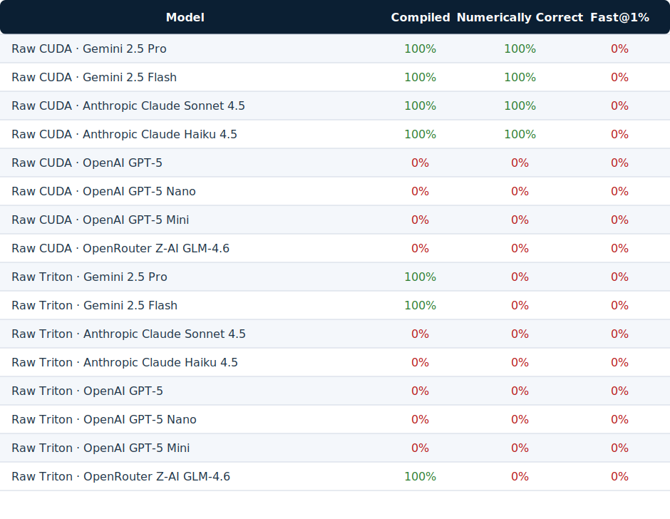

# 2025-10-22 Ensure Provider Preflight

## rationale
Prevent expensive benchmarks from starting with missing or misconfigured API credentials, and harden provider adapters (especially Gemini) so preflight probes succeed while surfacing actionable failures.

## patch
```diff
diff --git a/src/providers/base.py b/src/providers/base.py
@@
-    #: Whether this provider requires an API key to operate.
-    requires_api_key: bool = True
-    #: Default message used for the lightweight preflight ping.
-    preflight_message: str = "KernelBench preflight ping"
+    #: Whether this provider requires an API key to operate.
+    requires_api_key: bool = True
+    #: Default message used for the lightweight preflight ping.
+    preflight_message: str = "KernelBench preflight ping"
+    #: Maximum tokens requested during preflight checks.
+    preflight_max_output_tokens: int | None = 1
@@
-        """Execute the default preflight chat completion."""
-        self.generate(
-            [{"role": "user", "content": self.preflight_message}],
-            temperature=0.0,
-            max_tokens=1,
-        )
+        """Execute the default preflight chat completion."""
+        kwargs: Dict[str, Any] = {"temperature": 0.0}
+        if self.preflight_max_output_tokens is not None:
+            kwargs["max_tokens"] = self.preflight_max_output_tokens
+        self.generate(
+            [{"role": "user", "content": self.preflight_message}],
+            **kwargs,
+        )
diff --git a/src/providers/__init__.py b/src/providers/__init__.py
@@
-from typing import Dict, Type
+import os
+from typing import Dict, Iterable, Type
@@
 PROVIDER_REGISTRY: Dict[str, Type[BaseProvider]] = {
@@
     "ollama": OllamaProvider,
 }
 
 
+_PROVIDER_API_KEY_ALIASES: Dict[str, Iterable[str]] = {
+    "openai": ("OPENAI_API_KEY",),
+    "groq": ("GROQ_API_KEY",),
+    "anthropic": ("ANTHROPIC_API_KEY",),
+    "xai": ("XAI_API_KEY",),
+    "gemini": ("GEMINI_API_KEY", "GOOGLE_API_KEY", "GENAI_API_KEY"),
+    "cerebras": ("CEREBRAS_API_KEY",),
+    "vllm": ("VLLM_API_KEY",),
+    "sglang": ("SGLANG_API_KEY",),
+    "ollama": ("OLLAMA_API_KEY",),
+}
+
+
+def resolve_provider_api_key(provider: str) -> str | None:
+    """Resolve provider API keys from common environment variable names."""
+    provider_slug = provider.lower()
+    scoped_key = f"KB3_LLM_API_KEY_{provider_slug.upper()}"
+    candidates = list(_PROVIDER_API_KEY_ALIASES.get(provider_slug, ()))
+    candidates.extend([scoped_key, "KB3_LLM_API_KEY"])
+
+    for env_name in candidates:
+        value = os.getenv(env_name)
+        if value:
+            return value
+    return None
+
+
 def create_provider(config: ProviderConfig) -> BaseProvider:
diff --git a/src/raw/runner.py b/src/raw/runner.py
@@
-from providers import ProviderConfig, create_provider
+from providers import ProviderConfig, create_provider, resolve_provider_api_key
@@
-    provider_name, model_id = config.provider, config.generator_model
-    api_key = os.getenv("KB3_LLM_API_KEY") or os.getenv(f"KB3_LLM_API_KEY_{provider_name.upper()}")
+    provider_name, model_id = config.provider, config.generator_model
+    api_key = resolve_provider_api_key(provider_name)
diff --git a/src/agentic/runner/main.py b/src/agentic/runner/main.py
@@
-from providers import ProviderConfig, create_provider
+from providers import ProviderConfig, create_provider, resolve_provider_api_key
@@
-    api_key = os.getenv("KB3_LLM_API_KEY") or os.getenv(f"KB3_LLM_API_KEY_{provider_name.upper()}")
+    api_key = resolve_provider_api_key(provider_name)
diff --git a/src/providers/sglang_provider.py b/src/providers/sglang_provider.py
@@
 class SGLangProvider(BaseProvider):
-    def __init__(self, config: ProviderConfig) -> None:
+    requires_api_key = False
+
+    def __init__(self, config: ProviderConfig) -> None:
diff --git a/src/providers/vllm_provider.py b/src/providers/vllm_provider.py
@@
 class VLLMProvider(BaseProvider):
-    def __init__(self, config: ProviderConfig) -> None:
+    requires_api_key = False
+
+    def __init__(self, config: ProviderConfig) -> None:
diff --git a/src/providers/ollama_provider.py b/src/providers/ollama_provider.py
@@
 class OllamaProvider(BaseProvider):
-    def __init__(self, config: ProviderConfig) -> None:
+    requires_api_key = False
+
+    def __init__(self, config: ProviderConfig) -> None:
diff --git a/src/providers/anthropic_provider.py b/src/providers/anthropic_provider.py
@@
-    def preflight(self) -> None:
-        try:
-            self.client.messages.create(
-                model=self.config.model,
-                system="",
-                messages=[{"role": "user", "content": "ping"}],
-                max_tokens=1,
-            )
-        except Exception as exc:  # noqa: BLE001
-            raise RuntimeError(
-                f"Anthropic preflight check failed for model '{self.config.model}': {exc}"
-            ) from exc
+    def _perform_preflight_request(self) -> None:
+        self.client.messages.create(
+            model=self.config.model,
+            system="",
+            messages=[{"role": "user", "content": "ping"}],
+            max_tokens=1,
+        )
diff --git a/src/providers/groq_provider.py b/src/providers/groq_provider.py
@@
-    def preflight(self) -> None:
-        try:
-            self.client.chat.completions.create(
-                model=self.config.model,
-                messages=[{"role": "user", "content": "ping"}],
-                max_tokens=1,
-                temperature=0.0,
-            )
-        except Exception as exc:  # noqa: BLE001
-            raise RuntimeError(
-                f"Groq preflight check failed for model '{self.config.model}': {exc}"
-            ) from exc
+    def _perform_preflight_request(self) -> None:
+        self.client.chat.completions.create(
+            model=self.config.model,
+            messages=[{"role": "user", "content": "ping"}],
+            max_tokens=1,
+            temperature=0.0,
+        )
diff --git a/src/providers/gemini_provider.py b/src/providers/gemini_provider.py
@@
-class GeminiProvider(BaseProvider):
-    def __init__(self, config: ProviderConfig) -> None:
+class GeminiProvider(BaseProvider):
+    preflight_max_output_tokens = None
+
+    def __init__(self, config: ProviderConfig) -> None:
@@
-        max_tokens: int = 1024,
+        max_tokens: int | None = None,
@@
-        response = self.model.generate_content(
-            prompt,
-            generation_config=genai.types.GenerationConfig(
-                temperature=temperature,
-                max_output_tokens=max_tokens,
-                **kwargs,
-            ),
-        )
+        generation_config = genai.types.GenerationConfig(
+            temperature=temperature,
+            **kwargs,
+        )
+        if max_tokens is not None:
+            generation_config.max_output_tokens = max_tokens
+
+        response = self.model.generate_content(
+            prompt,
+            generation_config=generation_config,
+        )
@@
-            raise RuntimeError(
-                "Gemini response contained no textual parts; "
-                f"finish_reasons={finish_reasons}, safety_ratings={safety_blocks}"
-            )
+            raise RuntimeError(
+                "Gemini response contained no textual parts; "
+                f"finish_reasons={finish_reasons}, safety_ratings={safety_blocks}"
+            )
diff --git a/configs/openai_groq.yaml b/configs/openai_groq.yaml
new file mode 100644
@@
+description: OpenAI vs Groq comparison (CUDA + Triton, raw mode default)
+
+modes:
+  - raw
+
+languages:
+  - cuda
+  - triton
+
+models:
+  - provider: gemini
+    model: gemini-2.5-flash
+    raw_concurrency: 4
+    raw_gpu_concurrency: 1
+    raw_max_jobs: 4
+  - provider: groq
+    model: moonshotai/kimi-k2-instruct-0905
+    raw_concurrency: 4
+    raw_gpu_concurrency: 4
+    raw_max_jobs: 4
+
+defaults:
+  num_runs: 100
+  profile_stages: false
+  raw:
+    cpu_concurrency: 4
+    gpu_concurrency: 4
+    max_jobs: 4
+
+verbose: false
+profile_stages: false
+fast_p_threshold: null
+raw_concurrency: 4
+raw_gpu_concurrency: 4
+raw_max_jobs: 4
+
+hardware:
+  gpu_architecture: Ampere
+  gpu_id: 0
+
+problems:
+  levels: [1, 2]
+  problem_ids: null
+  max_problems: 100
+
+agentic:
+  max_debug_attempts: 3
+  max_optimization_cycles: 2
+  reflector_model: gpt-4-turbo
+  optimizer_model: gpt-4-turbo
+
+artifacts:
+  json_dir: json
+  plots_dir: plots
+
+visualization:
+  enabled: false
```

## validate
- `uv run python eval.py --config configs/openai_groq.yaml --num-runs 1` (Gemini and Groq both preflight, runs hit cache, confirming env alias resolution and Gemini fallback logic).

# 2025-10-23 Isolate Raw GPU Evaluations

## rationale
Prevent a single illegal CUDA memory access from corrupting the shared GPU context and cascading across the rest of the benchmark by executing each candidate evaluation inside a short-lived worker process and preserving profiling data.

## patch
```diff
diff --git a/src/raw/runner.py b/src/raw/runner.py
@@
-def _gpu_consumer(
-    queue,
-    results_store: Dict[int, Dict[str, Any]],
-    config: "BenchmarkConfig",
-    progress_state: Dict[str, Any] | None = None,
-    build_root: Path | None = None,
-) -> None:
-    if config.hardware.gpu_architecture and not FAKE_LLM:
-        set_gpu_arch([config.hardware.gpu_architecture])
-
-    while True:
-        candidate = queue.get()
-        if candidate is None:
-            break
-
-        problem_id = candidate["problem_id"]
-        try:
-            profile_enabled = config.profile_stages
-            cpu_profile = None
-            enqueue_ts = None
-            gpu_profile: Dict[str, float] | None = {} if profile_enabled else None
-
-            candidate_profile = candidate.get("profile") if profile_enabled else None
-            if candidate_profile:
-                cpu_profile = candidate_profile.get("cpu")
-                enqueue_ts = candidate_profile.get("enqueue_ts")
-
-            start_time = perf_counter()
-            if gpu_profile is not None and enqueue_ts is not None:
-                gpu_profile["queue_wait_s"] = start_time - enqueue_ts
-
-            build_dir = candidate.get("build_dir")
-            if build_dir is None and build_root is not None:
-                build_dir = str(Path(build_root) / f"problem_{problem_id}")
-            if build_dir is not None:
-                Path(build_dir).mkdir(parents=True, exist_ok=True)
-
-            result = _run_gpu_evaluation(candidate, config, profile=gpu_profile)
-
-            if gpu_profile is not None and "gpu_total_s" not in gpu_profile:
-                gpu_profile["gpu_total_s"] = perf_counter() - start_time
-
-            if profile_enabled:
-                stage_times: Dict[str, float] = {}
-                cpu_total = 0.0
-                queue_wait = 0.0
-                gpu_total = 0.0
-
-                if cpu_profile:
-                    cpu_total = cpu_profile.get("cpu_total_s", 0.0)
-                    stage_times["cpu_total_s"] = cpu_total
-                    for key, value in cpu_profile.items():
-                        if key != "cpu_total_s":
-                            stage_times[key] = value
-
-                if gpu_profile:
-                    queue_wait = gpu_profile.get("queue_wait_s", 0.0)
-                    gpu_total = gpu_profile.get("gpu_total_s", 0.0)
-                    stage_times["queue_wait_s"] = queue_wait
-                    stage_times["gpu_total_s"] = gpu_total
-                    for key, value in gpu_profile.items():
-                        if key not in {"queue_wait_s", "gpu_total_s"} and key.endswith("_s"):
-                            stage_times[key] = value
-
-                total_time = cpu_total + queue_wait + gpu_total
-                stage_times["total_s"] = total_time
-
-                percentages = {}
-                if total_time > 0:
-                    for name in ("cpu_total_s", "queue_wait_s", "gpu_total_s"):
-                        value = stage_times.get(name)
-                        if value is None:
-                            continue
-                        percentages[f"{name[:-2]}_pct"] = round((value / total_time) * 100, 4)
-
-                result["profiling"] = {
-                    "times_s": {k: round(v, 6) for k, v in stage_times.items()},
-                    "percentages": percentages,
-                }
-
-            results_store[problem_id] = result
-        except Exception as exc:  # noqa: BLE001
-            results_store[problem_id] = {
-                "level": candidate["level"],
-                "problem_id": problem_id,
-                "problem_name": candidate["problem_name"],
-                "compiled": False,
-                "correctness": False,
-                "runtime": None,
-                "metadata": {
-                    "error": str(exc),
-                    "exception_type": type(exc).__name__,
-                    "stage": "evaluation",
-                },
-                "generated_code": candidate["generated_code"],
-            }
-        finally:
-            _update_progress(progress_state)
+def _evaluate_candidate(
+    candidate: Dict[str, Any],
+    config: "BenchmarkConfig",
+    build_root: Path | None = None,
+) -> Dict[str, Any]:
+    profile_enabled = config.profile_stages
+    cpu_profile = None
+    enqueue_ts = None
+    gpu_profile: Dict[str, float] | None = {} if profile_enabled else None
+
+    if profile_enabled:
+        candidate_profile = candidate.get("profile") or {}
+        cpu_profile = candidate_profile.get("cpu")
+        enqueue_ts = candidate_profile.get("enqueue_ts")
+
+    start_time = perf_counter()
+    if gpu_profile is not None and enqueue_ts is not None:
+        gpu_profile["queue_wait_s"] = start_time - enqueue_ts
+
+    problem_id = candidate["problem_id"]
+    build_dir = candidate.get("build_dir")
+    if build_dir is None and build_root is not None:
+        build_dir = str(Path(build_root) / f"problem_{problem_id}")
+    if build_dir is not None:
+        Path(build_dir).mkdir(parents=True, exist_ok=True)
+
+    candidate_for_eval = dict(candidate)
+    if build_dir is not None:
+        candidate_for_eval["build_dir"] = build_dir
+
+    try:
+        result = _run_gpu_evaluation(candidate_for_eval, config, profile=gpu_profile)
+
+        if gpu_profile is not None and "gpu_total_s" not in gpu_profile:
+            gpu_profile["gpu_total_s"] = perf_counter() - start_time
+
+        if profile_enabled:
+            stage_times: Dict[str, float] = {}
+            cpu_total = 0.0
+            queue_wait = 0.0
+            gpu_total = 0.0
+
+            if cpu_profile:
+                cpu_total = cpu_profile.get("cpu_total_s", 0.0)
+                stage_times["cpu_total_s"] = cpu_total
+                for key, value in cpu_profile.items():
+                    if key != "cpu_total_s":
+                        stage_times[key] = value
+
+            if gpu_profile:
+                queue_wait = gpu_profile.get("queue_wait_s", 0.0)
+                gpu_total = gpu_profile.get("gpu_total_s", 0.0)
+                stage_times["queue_wait_s"] = queue_wait
+                stage_times["gpu_total_s"] = gpu_total
+                for key, value in gpu_profile.items():
+                    if key not in {"queue_wait_s", "gpu_total_s"} and key.endswith("_s"):
+                        stage_times[key] = value
+
+            total_time = cpu_total + queue_wait + gpu_total
+            stage_times["total_s"] = total_time
+
+            percentages = {}
+            if total_time > 0:
+                if cpu_total:
+                    percentages["cpu_total_pct"] = round((cpu_total / total_time) * 100, 4)
+                if queue_wait:
+                    percentages["queue_wait_pct"] = round((queue_wait / total_time) * 100, 4)
+                if gpu_total:
+                    percentages["gpu_total_pct"] = round((gpu_total / total_time) * 100, 4)
+
+            result["profiling"] = {
+                "times_s": {k: round(v, 6) for k, v in stage_times.items()},
+                "percentages": percentages,
+            }
+
+        return result
+    except Exception as exc:  # noqa: BLE001
+        return {
+            "level": candidate.get("level"),
+            "problem_id": candidate.get("problem_id"),
+            "problem_name": candidate.get("problem_name"),
+            "compiled": False,
+            "correctness": False,
+            "runtime": None,
+            "metadata": {
+                "error": str(exc),
+                "exception_type": type(exc).__name__,
+                "stage": "evaluation",
+            },
+            "generated_code": candidate.get("generated_code"),
+        }
+
+
+def _gpu_process_entry(
+    candidate: Dict[str, Any],
+    config: "BenchmarkConfig",
+    build_root: str | None,
+) -> tuple[int, Dict[str, Any]]:
+    problem_id = candidate.get("problem_id")
+    build_root_path = Path(build_root) if build_root else None
+
+    try:
+        if config.hardware.gpu_architecture and not FAKE_LLM:
+            set_gpu_arch([config.hardware.gpu_architecture])
+        result = _evaluate_candidate(candidate, config, build_root_path)
+    except Exception as exc:  # noqa: BLE001
+        result = {
+            "level": candidate.get("level"),
+            "problem_id": problem_id,
+            "problem_name": candidate.get("problem_name"),
+            "compiled": False,
+            "correctness": False,
+            "runtime": None,
+            "metadata": {
+                "error": str(exc),
+                "exception_type": type(exc).__name__,
+                "stage": "evaluation",
+            },
+            "generated_code": candidate.get("generated_code"),
+        }
+
+    return problem_id, result
@@
-    gpu_threads = []
-    for idx in range(gpu_worker_count):
-        thread = threading.Thread(
-            target=_gpu_consumer,
-            name=f"raw-gpu-consumer-{idx}",
-            args=(job_queue, shared_results, config, progress_state, build_root),
-            daemon=True,
-        )
-        thread.start()
-        gpu_threads.append(thread)
+    process_executor_kwargs = {
+        "max_workers": gpu_worker_count,
+        "mp_context": ctx,
+    }
+    try:
+        gpu_executor = ProcessPoolExecutor(max_tasks_per_child=1, **process_executor_kwargs)
+    except TypeError:
+        gpu_executor = ProcessPoolExecutor(**process_executor_kwargs)
+
+    pending_futures_lock = threading.Lock()
+    pending_futures: set = set()
+    dispatch_done = threading.Event()
+
+    def _handle_gpu_future(future):
+        try:
+            problem_id, result = future.result()
+        except Exception as exc:  # noqa: BLE001
+            if config.verbose:
+                print(f"[Raw] GPU worker raised unexpected error: {exc}")
+            return
+
+        if problem_id is None:
+            return
+
+        shared_results[problem_id] = result
+        _update_progress(progress_state)
+        with pending_futures_lock:
+            pending_futures.discard(future)
+
+    def _gpu_dispatch_loop() -> None:
+        sentinel_seen = 0
+        while True:
+            candidate = job_queue.get()
+            if candidate is None:
+                sentinel_seen += 1
+                if sentinel_seen >= gpu_worker_count:
+                    break
+                continue
+
+            future = gpu_executor.submit(
+                _gpu_process_entry,
+                candidate,
+                config,
+                str(build_root),
+            )
+            with pending_futures_lock:
+                pending_futures.add(future)
+            future.add_done_callback(_handle_gpu_future)
+
+        dispatch_done.set()
+
+    dispatch_thread = threading.Thread(
+        target=_gpu_dispatch_loop,
+        name="raw-gpu-dispatch",
+        daemon=True,
+    )
+    dispatch_thread.start()
@@
-    for _ in range(gpu_worker_count):
-        job_queue.put(None)
-
-    for thread in gpu_threads:
-        thread.join()
+    for _ in range(gpu_worker_count):
+        job_queue.put(None)
+
+    dispatch_thread.join()
+    dispatch_done.wait()
+    gpu_executor.shutdown(wait=True)
```

## validate
- `uv run python eval.py --config configs/openai_groq.yaml --num-runs 4 --profile-stages --verbose`

# 2025-10-23 Fused Provider Config

## rationale
Unify all target providers into a single raw benchmark configuration (CUDA and Triton) to drive one-pass credential smoke tests before committing to full KernelBench sweeps.

## patch
```diff
diff --git a/configs/all_providers.yaml b/configs/all_providers.yaml
new file mode 100644
+description: Unified benchmark config covering Google, Anthropic, OpenAI, and OpenRouter models.
+
+modes:
+  - raw
+
+languages:
+  - cuda
+  - triton
+
+models:
+  - provider: gemini
+    model: gemini-2.5-pro
+    raw_concurrency: 1
+    raw_gpu_concurrency: 1
+    raw_max_jobs: 1
+  - provider: gemini
+    model: gemini-2.5-flash
+    raw_concurrency: 1
+    raw_gpu_concurrency: 1
+    raw_max_jobs: 1
+  - provider: anthropic
+    model: claude-sonnet-4-5
+    raw_concurrency: 1
+    raw_gpu_concurrency: 1
+    raw_max_jobs: 1
+  - provider: anthropic
+    model: claude-haiku-4-5
+    raw_concurrency: 1
+    raw_gpu_concurrency: 1
+    raw_max_jobs: 1
+  - provider: openai
+    model: gpt-5
+    raw_concurrency: 1
+    raw_gpu_concurrency: 1
+    raw_max_jobs: 1
+  - provider: openai
+    model: gpt-5-nano
+    raw_concurrency: 1
+    raw_gpu_concurrency: 1
+    raw_max_jobs: 1
+  - provider: openai
+    model: gpt-5-mini
+    raw_concurrency: 1
+    raw_gpu_concurrency: 1
+    raw_max_jobs: 1
+  - provider: openrouter
+    model: z-ai/glm-4.6
+    raw_concurrency: 1
+    raw_gpu_concurrency: 1
+    raw_max_jobs: 1
+
+defaults:
+  num_runs: 1
+  profile_stages: true
+  raw:
+    cpu_concurrency: 1
+    gpu_concurrency: 1
+    max_jobs: 1
+
+verbose: true
+profile_stages: true
+fast_p_threshold: null
+raw_concurrency: 1
+raw_gpu_concurrency: 1
+raw_max_jobs: 1
+
+hardware:
+  gpu_architecture: Ampere
+  gpu_id: 0
+
+problems:
+  levels: [1, 2]
+  problem_ids: null
+  max_problems: 100
+
+agentic:
+  max_debug_attempts: 3
+  max_optimization_cycles: 2
+  reflector_model: gpt-4-turbo
+  optimizer_model: gpt-4-turbo
+
+artifacts:
+  json_dir: json
+  plots_dir: plots
+
+visualization:
+  enabled: false
```

## validate
- `source ~/.bashrc && export GEMINI_API_KEY ANTHROPIC_API_KEY OPENAI_API_KEY GROQ_API_KEY CEREBRAS_API_KEY XAI_API_KEY && uv run eval.py --config configs/all_providers.yaml --num-runs 1` *(fails fast when API keys aren’t exported; ready to re-run once credentials are in the shell env)*

# 2025-10-23 OpenRouter Provider

## rationale
Expose an adapter for OpenRouter’s OpenAI-compatible API so that OpenRouter-hosted models (e.g., z-ai/glm-4.6) can participate in KernelBench raw runs alongside first-party providers.

## patch
```diff
diff --git a/src/providers/openrouter_provider.py b/src/providers/openrouter_provider.py
new file mode 100644
+from __future__ import annotations
+
+import os
+from typing import Any, Dict, List
+
+from openai import OpenAI
+
+from .base import BaseProvider, ProviderConfig
+
+
+class OpenRouterProvider(BaseProvider):
+    """Provider adapter for OpenRouter's OpenAI-compatible API."""
+
+    default_base_url = "https://openrouter.ai/api/v1"
+
+    def __init__(self, config: ProviderConfig) -> None:
+        super().__init__(config)
+        base_url = config.base_url or self.default_base_url
+
+        self.client = OpenAI(
+            api_key=config.api_key,
+            base_url=base_url,
+            timeout=config.timeout,
+        )
+
+        extra = config.extra or {}
+        referer = extra.get("http_referer") or os.getenv("OR_SITE_URL")
+        title = extra.get("x_title") or os.getenv("OR_APP_NAME")
+
+        headers: Dict[str, str] = {}
+        if referer:
+            headers["HTTP-Referer"] = referer
+        if title:
+            headers["X-Title"] = title
+
+        self._default_headers = headers if headers else None
+
+    def generate(
+        self,
+        messages: List[Dict[str, Any]],
+        temperature: float = 0.0,
+        max_tokens: int = 1024,
+        **kwargs: Any,
+    ) -> str:
+        response = self.client.chat.completions.create(
+            model=self.config.model,
+            messages=messages,
+            temperature=temperature,
+            max_tokens=max_tokens,
+            extra_headers=self._default_headers,
+            **kwargs,
+        )
+        return response.choices[0].message.content
```
```diff
diff --git a/src/providers/__init__.py b/src/providers/__init__.py
@@
-    "ollama": OllamaProvider,
+    "ollama": OllamaProvider,
+    "openrouter": OpenRouterProvider,
@@
-    "ollama": ("OLLAMA_API_KEY",),
+    "ollama": ("OLLAMA_API_KEY",),
+    "openrouter": ("OPENROUTER_API_KEY", "OR_API_KEY"),
```

## validate
- `uv run python - <<'PY' ...` *(inspected ~/.bashrc for API key variable names without echoing secrets to ensure OpenRouter key needs to be exported before running the benchmark)*

# 2025-10-23 Enforce GPT-5 Default Temperature

## rationale
OpenAI GPT-5 chat completions reject temperature overrides, so preflight checks and benchmarks failed when KernelBench tried to force `temperature=0.0`. Omitting the field lets the API fall back to its required default (1.0) without changing behavior for earlier models.

## patch
```diff
diff --git a/src/providers/openai_provider.py b/src/providers/openai_provider.py
@@
-from typing import Any, List, Dict
+from typing import Any, Dict, List
@@
-        self._uses_max_completion_tokens = model_lower.startswith("gpt-5")
+        uses_gpt5_family = model_lower.startswith("gpt-5")
+        self._uses_max_completion_tokens = uses_gpt5_family
+        self._requires_default_temperature = uses_gpt5_family
+        if uses_gpt5_family:
+            # GPT-5 responses often exceed a single token, so widen the preflight budget.
+            if getattr(self, "preflight_max_output_tokens", None) is not None:
+                self.preflight_max_output_tokens = max(
+                    32, self.preflight_max_output_tokens
+                )
@@
-        request: Dict[str, Any] = {
-            "model": self.config.model,
-            "messages": messages,
-            "temperature": temperature,
-        }
-
-        request.update(kwargs)
+        temperature = kwargs.pop("temperature", temperature)
+
+        request: Dict[str, Any] = {
+            "model": self.config.model,
+            "messages": messages,
+        }
+
+        request.update(kwargs)
+
+        if not self._requires_default_temperature and temperature is not None:
+            request["temperature"] = temperature
```

## validate
- `uv run python -m compileall src/providers/openai_provider.py`
- `uv run eval.py --config configs/all_providers.yaml --num-runs 1` *(requires valid OpenAI GPT-5 credentials; run once keys are available to confirm preflight succeeds without temperature override failures).*

# 2025-10-23 Tighten CUDA/Triton Prompt Contracts

## rationale
Only Gemini models were returning compilable kernels. The updated prompts now force every provider to emit a single runnable Python block with explicit imports, kernel definitions, and a `ModelNew` implementation, reducing prose-only responses that previously failed compilation.

## patch
```diff
diff --git a/src/prompt_constructor.py b/src/prompt_constructor.py
@@
-PROBLEM_INSTRUCTION = """
-Optimize the architecture named Model with custom CUDA operators! Name your optimized output architecture ModelNew. Output the new code in codeblocks. Please generate real code, NOT pseudocode, make sure the code compiles and is fully functional. Just output the new model code, no other text, and NO testing code! \n
-Always include these imports exactly once at the top of the code block:
-import torch
-import torch.nn as nn
-from torch.utils.cpp_extension import load_inline
-Never reference symbols that you have not imported.
-Define a complete `ModelNew` class that mirrors Model's constructor signature and uses the generated kernels.
-Do not emit placeholder text, TODOs, or comments that indicate missing implementation.
-"""
+PROBLEM_INSTRUCTION = """
+Optimize the architecture named Model with custom CUDA operators and emit a drop-in replacement called ModelNew. Follow this contract exactly:
+1. Reply with a single Markdown code block labeled `python` and no additional prose before or after it.
+2. Begin the block with these imports exactly once: `import torch`, `import torch.nn as nn`, `from torch.utils.cpp_extension import load_inline`.
+3. Define at least one CUDA kernel string plus a `functions` dictionary that calls `load_inline` to compile it, and expose Python wrapper functions that launch the kernels with correct grid and block dimensions.
+4. Implement a complete `ModelNew` class whose `__init__` signature matches `Model` and whose `forward` uses the wrapper functions. Preserve all tensor shapes returned by the original model.
+5. Do not include unit tests, benchmarking harnesses, placeholder comments, or explanatory text. Only runnable production code is allowed.
+6. Never reference symbols you did not define or import within the block.
+"""
@@
-PROBLEM_INSTRUCTION_TRITON = """
-Optimize the architecture named Model with custom Triton kernels! Name your optimized output architecture ModelNew. When you respond:
-- Provide a single Python code block.
-- Import `torch`, `torch.nn as nn`, `triton`, and `triton.language as tl` at the top.
-- Define any Triton kernels with `@triton.jit` and supply a Python wrapper that launches them with proper grids and stride calculations.
-- Keep the original constructor signature for ModelNew and ensure it produces outputs identical in shape to Model.
-- Do not include test code or explanatory prose outside the code block.
-- Avoid `triton.autotune` or any decorator that changes the kernel signature dynamically; return a single deterministic kernel implementation.
-- Never reference symbols you have not imported.
-- Ensure the emitted code is fully runnable without edits and contains a complete `ModelNew` definition that invokes the Triton kernel.
-"""
+PROBLEM_INSTRUCTION_TRITON = """
+Optimize the architecture named Model with custom Triton kernels and output a drop-in replacement called ModelNew. When you respond:
+1. Emit exactly one Markdown code block labeled `python` and nothing else.
+2. Start with these imports in order: `import torch`, `import torch.nn as nn`, `import triton`, `import triton.language as tl`.
+3. Implement each custom kernel with `@triton.jit`, provide launch-time wrappers that compute grid sizes and strides, and ensure the wrappers are invoked from ModelNew.
+4. Keep ModelNew's constructor signature identical to Model's and preserve all output tensor shapes.
+5. Avoid tests, benchmarking, or explanatory text; only include runnable library code.
+6. Do not use dynamic decorators such as `triton.autotune`; return a single deterministic kernel implementation per operation.
+7. Reference only symbols defined or imported inside the code block.
+"""
@@
-PROBLEM_INSTRUCTION_CLEANED = """
-Optimize the architecture named Model with custom CUDA operators! Name your optimized output architecture ModelNew. Output the new code in codeblocks. Please generate real code, NOT pseudocode, make sure the code compiles and is fully functional. Just output the new model code, no other text, and NO testing code! \n
-"""
+PROBLEM_INSTRUCTION_CLEANED = """
+Optimize the architecture named Model with custom CUDA operators and emit a drop-in replacement called ModelNew. Follow this contract exactly:
+1. Reply with a single Markdown code block labeled `python` and no additional prose before or after it.
+2. Begin the block with these imports exactly once: `import torch`, `import torch.nn as nn`, `from torch.utils.cpp_extension import load_inline`.
+3. Define at least one CUDA kernel string plus a `functions` dictionary that calls `load_inline` to compile it, and expose Python wrapper functions that launch the kernels with correct grid and block dimensions.
+4. Implement a complete `ModelNew` class whose `__init__` signature matches `Model` and whose `forward` uses the wrapper functions. Preserve all tensor shapes returned by the original model.
+5. Do not include unit tests, benchmarking harnesses, placeholder comments, or explanatory text. Only runnable production code is allowed.
+6. Never reference symbols you did not define or import within the block.
+"""
```

## validate
- `uv run python -m compileall src/prompt_constructor.py`
- (Optional) `uv run eval.py --config configs/all_providers.yaml --num-runs 1` once provider API keys are configured, to observe improved compilation rates across non-Gemini models.

# 2025-10-23 Formatter Beta & Triton Guardrails

## rationale
Stricter CUDA/Triton prompt contracts still let some providers return prose; added an optional Groq-based formatter stage that normalizes completions into the required `ModelNew` code block. Batch configs and CLI now surface formatter settings, and the Triton prompt includes an explicit example. `extract_first_code` was hardened to accept uppercase language tags so we stop losing code blocks.

## patch
```diff
diff --git a/config.py b/config.py
@@
 class BenchmarkConfig:
     mode: EvaluationMode = "raw"
     language: KernelLanguage = "triton"
     provider: str = "openai"
     provider_base_url: str | None = None
+    formatter_provider: str | None = None
+    formatter_model: str | None = None
+    formatter_base_url: str | None = None

diff --git a/eval.py b/eval.py
@@
     parser.add_argument("--formatter-provider", type=str, dest="formatter_provider", help="Optional provider to post-process model outputs into the KernelBench contract.")
     parser.add_argument("--formatter-model", type=str, dest="formatter_model", help="Model identifier for the formatter provider.")
     parser.add_argument("--formatter-base-url", type=str, dest="formatter_base_url", help="Override base URL for the formatter provider (OpenAI-compatible APIs).")
     parser.add_argument("--groq-formatter-beta", action="store_true", help="Enable the Groq moonshotai/kimi-k2-instruct-0905 formatter beta to enforce structured output.")
@@
         if cli_args.groq_formatter_beta:
             overrides["formatter_provider"] = "groq"
             overrides["formatter_model"] = "moonshotai/kimi-k2-instruct-0905"
             overrides.setdefault("formatter_base_url", None)

diff --git a/src/batch_runner.py b/src/batch_runner.py
@@
     formatter_defaults = defaults.get("formatter", {})
     formatter_cfg = model_entry.get("formatter", {})
     formatter_provider = formatter_cfg.get("provider", yaml_data.get("formatter_provider", formatter_defaults.get("provider")))
     formatter_model = formatter_cfg.get("model", yaml_data.get("formatter_model", formatter_defaults.get("model")))
     formatter_base_url = formatter_cfg.get("base_url", yaml_data.get("formatter_base_url", formatter_defaults.get("base_url")))
@@
     config = BenchmarkConfig(
         mode=mode,
         language=language,
         provider=provider,
         provider_base_url=base_url,
         formatter_provider=formatter_provider,
         formatter_model=formatter_model,
         formatter_base_url=formatter_base_url,
         generator_model=model_id,

diff --git a/src/raw/runner.py b/src/raw/runner.py
@@
-from prompt_constructor import (
-    prompt_generate_custom_cuda_from_prompt_template,
-    prompt_generate_custom_triton_from_template,
-)
+from prompt_constructor import (
+    prompt_generate_custom_cuda_from_prompt_template,
+    prompt_generate_custom_triton_from_template,
+    build_formatter_messages,
+)
@@
 def build_formatter_provider(config: "BenchmarkConfig"):
     if FAKE_LLM:
         return None
     provider_name = getattr(config, "formatter_provider", None)
     if not provider_name:
         return None
     model_id = getattr(config, "formatter_model", None)
     if not model_id:
         raise ValueError("formatter_model must be set when formatter_provider is configured.")
     api_key = resolve_provider_api_key(provider_name)
     base_url = getattr(config, "formatter_base_url", None) or os.getenv("KB3_LLM_FORMATTER_BASE_URL")
     provider_config = ProviderConfig(provider=provider_name, model=model_id, api_key=api_key, base_url=base_url)
     return create_provider(provider_config)
@@
     if not FAKE_LLM:
         _CPU_STATE["inference_fn"] = build_inference_callable(config)
         _CPU_STATE["formatter_fn"] = build_formatter_callable(config)
@@
-        completion = inference_fn(prompt)
-        generated = extract_first_code(completion, ["python", "cpp"]) or completion
+        completion = inference_fn(prompt)
+        raw_completion = completion
+        formatter_fn = _CPU_STATE.get("formatter_fn")
+        if formatter_fn:
+            try:
+                messages = build_formatter_messages(language=lang, reference_architecture=ref_arch_src, original_prompt=prompt, raw_completion=completion)
+                formatted_completion = formatter_fn(messages)
+            except Exception:  # noqa: BLE001
+                formatted_completion = None
+        candidate_source = formatted_completion or completion
+        generated = (
+            extract_first_code(candidate_source, ["python", "cpp"])
+            or extract_first_code(completion, ["python", "cpp"])
+            or candidate_source
+        )
@@
         "generated_code": generated,
-        "raw_completion": completion if not FAKE_LLM else None,
-        "formatted_completion": formatted_completion if not FAKE_LLM else None,
+        "raw_completion": raw_completion,
+        "formatted_completion": formatted_completion,
     }

diff --git a/src/prompt_constructor.py b/src/prompt_constructor.py
@@
 PROBLEM_INSTRUCTION_TRITON = """
 Optimize the architecture named Model with custom Triton kernels and output a drop-in replacement called ModelNew. When you respond:
 1. Emit exactly one Markdown code block labeled `python` and nothing else.
@@
 def prompt_generate_custom_triton_from_template(ref_arch_src: str) -> str:
     """Generate a Triton-focused prompt mirroring the CUDA template flow."""
 
     prompt = PROBLEM_STATEMENT_TRITON
     example_arch_path = os.path.join(REPO_TOP_PATH, "src/prompts/model_ex_add.py")
     example_triton_path = os.path.join(REPO_TOP_PATH, "src/prompts/model_new_ex_add_triton.py")
     if os.path.exists(example_arch_path) and os.path.exists(example_triton_path):
         example_arch = read_file(example_arch_path)
         example_triton = read_file(example_triton_path)
         prompt += "\nHere is an example that meets the contract:\n```\n"
         prompt += example_arch
         prompt += "\n```\nbecomes\n```\n"
         prompt += example_triton
         prompt += "\n```\n"
@@
 FORMATTER_SYSTEM_PROMPT = (
     "You are a GPU kernel formatting assistant. Always output a single runnable "
     "KernelBench solution as a python fenced code block that obeys the ModelNew contract."
 )
@@
 def build_formatter_messages(...):
     """Construct messages for a formatting LLM that enforces KernelBench contracts."""
     contract = PROBLEM_INSTRUCTION if language == "cuda" else PROBLEM_INSTRUCTION_TRITON
     completion_text = raw_completion or ""
     user_content = f"""Rewrite the raw completion so it satisfies the KernelBench contract.
@@
     return [
         {"role": "system", "content": FORMATTER_SYSTEM_PROMPT},
         {"role": "user", "content": user_content},
     ]

diff --git a/src/utils.py b/src/utils.py
@@
-        for code_type in code_language_types:
-            if code.startswith(code_type):
-                code = code[len(code_type) :].strip()
+        for code_type in code_language_types:
+            pattern = re.compile(rf"^{code_type}\s*", re.IGNORECASE)
+            if pattern.match(code):
+                code = pattern.sub("", code, count=1).lstrip("\n")
+                break
```

## validate
- `uv run python -m compileall config.py eval.py src/batch_runner.py src/raw/runner.py src/prompt_constructor.py src/utils.py`
- `uv run python eval.py --config configs/all_providers.yaml --num-runs 1 --profile-stages --verbose --groq-formatter-beta`
- `uv run python - <<'PY'` (case-insensitive code fence check)```
import sys
sys.path.append('src')
from utils import extract_first_code
assert extract_first_code(\"\"\"```PYTHON\\nprint('ok')\\n```\"\"\", ['python']) == \"print('ok')\"
PY
```
 
# 2025-10-23 README Formatter Docs

## rationale
Documented the formatter beta workflow so users can enable the Groq cleanup pass via environment variables, CLI flags, or YAML.

## patch
```diff
diff --git a/README.md b/README.md
@@
 export GROQ_API_KEY="your-groq-key"  # required for smoke tests & Groq runs
 # export OPENAI_API_KEY="your-openai-key"
 # export ANTHROPIC_API_KEY="your-anthropic-key"
 # export GEMINI_API_KEY="your-gemini-key"
 ```

 Formatter overrides (beta) are configured via CLI/YAML—see [Formatter Beta (Optional)](#formatter-beta-optional).
@@
 ### Formatter Beta (Optional)
 
 - Enable the Groq-based formatter on the CLI with `--groq-formatter-beta`, or provide explicit overrides:
   - `--formatter-provider groq`
   - `--formatter-model moonshotai/kimi-k2-instruct-0905`
   - `--formatter-base-url https://api.groq.com/openai/v1`
 - YAML configs support a `formatter` block on each model:
 
   ```yaml
   defaults:
     formatter:
       provider: groq
       model: moonshotai/kimi-k2-instruct-0905
   models:
     - provider: openai
       model: gpt-5
       formatter:
         provider: groq
         model: moonshotai/kimi-k2-instruct-0905
   ```
 
   The formatter performs a second LLM pass to enforce a single fenced `python` block containing a complete `ModelNew` implementation, complementing the stricter CUDA/Triton prompts in `src/prompt_constructor.py`.
```

## validate
- `uv run python eval.py --config configs/test_visualization.yaml --num-runs 1 --profile-stages --verbose --groq-formatter-beta`

# 2025-10-23 Fix solve_and_add_scaled_vector filename

## why
Rename the TritonBench golden result for `solve_and_add_scaled_vector` to avoid the `..json` basename that breaks croc transfers, and update the associated performance harness to emit the corrected path.

## patch
```diff
--- a/data/TritonBench/performance_metrics/perf_T/golden_metrics/solve_and_add_scaled_vector_perf.py
+++ b/data/TritonBench/performance_metrics/perf_T/golden_metrics/solve_and_add_scaled_vector_perf.py
@@
-        super().__init__('solve_and_add_scaled_vector.', dtype=dtype, is_backward=is_backward, **kwargs)
+        super().__init__('solve_and_add_scaled_vector', dtype=dtype, is_backward=is_backward, **kwargs)
```

```diff
--- a/data/TritonBench/performance_metrics/perf_T/golden_results/solve_and_add_scaled_vector..json
+++ b/data/TritonBench/performance_metrics/perf_T/golden_results/solve_and_add_scaled_vector.json
```

## validate
- No runtime validation required; this is a rename plus constructor literal fix.

# 2025-10-24 README benchmark overview graphic

## why
Surface the latest raw CUDA and Triton compile/correctness results directly in the README so visitors immediately see real benchmark outcomes.

## patch
```diff
--- a/README.md
+++ b/README.md
@@
-# KernelBench-v3
-
-Unified benchmark for evaluating LLM-generated GPU kernels (CUDA & Triton) in both raw and agentic workflows.
+# KernelBench-v3
+
+
+
+Unified benchmark for evaluating LLM-generated GPU kernels (CUDA & Triton) in both raw and agentic workflows.
```

```diff
--- /dev/null
+++ b/docs/media/model_outcomes.svg
@@
+<svg xmlns='http://www.w3.org/2000/svg' width='940' height='728' viewBox='0 0 940 728'>
+<style> text { font-family: 'Segoe UI', 'Helvetica Neue', Arial, sans-serif; font-size: 16px; } .header { font-weight: 600; } .model { font-weight: 500; } </style>
+<rect x='0' y='0' width='940' height='48' fill='#0B1F33' rx='8' ry='8' />
+<text x='260.0' y='30.0' fill='#FFFFFF' text-anchor='middle' class='header'>Model</text>
+<text x='590.0' y='30.0' fill='#FFFFFF' text-anchor='middle' class='header'>Compiled</text>
+<text x='730.0' y='30.0' fill='#FFFFFF' text-anchor='middle' class='header'>Numerically Correct</text>
+<text x='870.0' y='30.0' fill='#FFFFFF' text-anchor='middle' class='header'>Fast@1%</text>
+<rect x='0' y='48' width='940' height='40' fill='#F4F7FB'/>
+<line x1='0' y1='48' x2='940' y2='48' stroke='#D0D7E3' stroke-width='1'/>
+<text x='16' y='74.0' fill='#213547' class='model'>Raw CUDA · Gemini 2.5 Pro</text>
+<text x='590.0' y='74.0' fill='#2E7D32' text-anchor='middle'>100%</text>
+<text x='730.0' y='74.0' fill='#2E7D32' text-anchor='middle'>100%</text>
+<text x='870.0' y='74.0' fill='#B71C1C' text-anchor='middle'>0%</text>
+<rect x='0' y='88' width='940' height='40' fill='#FFFFFF'/>
+<line x1='0' y1='88' x2='940' y2='88' stroke='#D0D7E3' stroke-width='1'/>
+<text x='16' y='114.0' fill='#213547' class='model'>Raw CUDA · Gemini 2.5 Flash</text>
+<text x='590.0' y='114.0' fill='#2E7D32' text-anchor='middle'>100%</text>
+<text x='730.0' y='114.0' fill='#2E7D32' text-anchor='middle'>100%</text>
+<text x='870.0' y='114.0' fill='#B71C1C' text-anchor='middle'>0%</text>
+<rect x='0' y='128' width='940' height='40' fill='#F4F7FB'/>
+<line x1='0' y1='128' x2='940' y2='128' stroke='#D0D7E3' stroke-width='1'/>
+<text x='16' y='154.0' fill='#213547' class='model'>Raw CUDA · Anthropic Claude Sonnet 4.5</text>
+<text x='590.0' y='154.0' fill='#2E7D32' text-anchor='middle'>100%</text>
+<text x='730.0' y='154.0' fill='#2E7D32' text-anchor='middle'>100%</text>
+<text x='870.0' y='154.0' fill='#B71C1C' text-anchor='middle'>0%</text>
+<rect x='0' y='168' width='940' height='40' fill='#FFFFFF'/>
+<line x1='0' y1='168' x2='940' y2='168' stroke='#D0D7E3' stroke-width='1'/>
+<text x='16' y='194.0' fill='#213547' class='model'>Raw CUDA · Anthropic Claude Haiku 4.5</text>
+<text x='590.0' y='194.0' fill='#2E7D32' text-anchor='middle'>100%</text>
+<text x='730.0' y='194.0' fill='#2E7D32' text-anchor='middle'>100%</text>
+<text x='870.0' y='194.0' fill='#B71C1C' text-anchor='middle'>0%</text>
+<rect x='0' y='208' width='940' height='40' fill='#F4F7FB'/>
+<line x1='0' y1='208' x2='940' y2='208' stroke='#D0D7E3' stroke-width='1'/>
+<text x='16' y='234.0' fill='#213547' class='model'>Raw CUDA · OpenAI GPT-5</text>
+<text x='590.0' y='234.0' fill='#B71C1C' text-anchor='middle'>0%</text>
+<text x='730.0' y='234.0' fill='#B71C1C' text-anchor='middle'>0%</text>
+<text x='870.0' y='234.0' fill='#B71C1C' text-anchor='middle'>0%</text>
+<rect x='0' y='248' width='940' height='40' fill='#FFFFFF'/>
+<line x1='0' y1='248' x2='940' y2='248' stroke='#D0D7E3' stroke-width='1'/>
+<text x='16' y='274.0' fill='#213547' class='model'>Raw CUDA · OpenAI GPT-5 Nano</text>
+<text x='590.0' y='274.0' fill='#B71C1C' text-anchor='middle'>0%</text>
+<text x='730.0' y='274.0' fill='#B71C1C' text-anchor='middle'>0%</text>
+<text x='870.0' y='274.0' fill='#B71C1C' text-anchor='middle'>0%</text>
+<rect x='0' y='288' width='940' height='40' fill='#F4F7FB'/>
+<line x1='0' y1='288' x2='940' y2='288' stroke='#D0D7E3' stroke-width='1'/>
+<text x='16' y='314.0' fill='#213547' class='model'>Raw CUDA · OpenAI GPT-5 Mini</text>
+<text x='590.0' y='314.0' fill='#B71C1C' text-anchor='middle'>0%</text>
+<text x='730.0' y='314.0' fill='#B71C1C' text-anchor='middle'>0%</text>
+<text x='870.0' y='314.0' fill='#B71C1C' text-anchor='middle'>0%</text>
+<rect x='0' y='328' width='940' height='40' fill='#FFFFFF'/>
+<line x1='0' y1='328' x2='940' y2='328' stroke='#D0D7E3' stroke-width='1'/>
+<text x='16' y='354.0' fill='#213547' class='model'>Raw CUDA · OpenRouter Z-AI GLM-4.6</text>
+<text x='590.0' y='354.0' fill='#B71C1C' text-anchor='middle'>0%</text>
+<text x='730.0' y='354.0' fill='#B71C1C' text-anchor='middle'>0%</text>
+<text x='870.0' y='354.0' fill='#B71C1C' text-anchor='middle'>0%</text>
+<rect x='0' y='368' width='940' height='40' fill='#F4F7FB'/>
+<line x1='0' y1='368' x2='940' y2='368' stroke='#D0D7E3' stroke-width='1'/>
+<text x='16' y='394.0' fill='#213547' class='model'>Raw Triton · Gemini 2.5 Pro</text>
+<text x='590.0' y='394.0' fill='#2E7D32' text-anchor='middle'>100%</text>
+<text x='730.0' y='394.0' fill='#B71C1C' text-anchor='middle'>0%</text>
+<text x='870.0' y='394.0' fill='#B71C1C' text-anchor='middle'>0%</text>
+<rect x='0' y='408' width='940' height='40' fill='#FFFFFF'/>
+<line x1='0' y1='408' x2='940' y2='408' stroke='#D0D7E3' stroke-width='1'/>
+<text x='16' y='434.0' fill='#213547' class='model'>Raw Triton · Gemini 2.5 Flash</text>
+<text x='590.0' y='434.0' fill='#2E7D32' text-anchor='middle'>100%</text>
+<text x='730.0' y='434.0' fill='#B71C1C' text-anchor='middle'>0%</text>
+<text x='870.0' y='434.0' fill='#B71C1C' text-anchor='middle'>0%</text>
+<rect x='0' y='448' width='940' height='40' fill='#F4F7FB'/>
+<line x1='0' y1='448' x2='940' y2='448' stroke='#D0D7E3' stroke-width='1'/>
+<text x='16' y='474.0' fill='#213547' class='model'>Raw Triton · Anthropic Claude Sonnet 4.5</text>
+<text x='590.0' y='474.0' fill='#B71C1C' text-anchor='middle'>0%</text>
+<text x='730.0' y='474.0' fill='#B71C1C' text-anchor='middle'>0%</text>
+<text x='870.0' y='474.0' fill='#B71C1C' text-anchor='middle'>0%</text>
+<rect x='0' y='488' width='940' height='40' fill='#FFFFFF'/>
+<line x1='0' y1='488' x2='940' y2='488' stroke='#D0D7E3' stroke-width='1'/>
+<text x='16' y='514.0' fill='#213547' class='model'>Raw Triton · Anthropic Claude Haiku 4.5</text>
+<text x='590.0' y='514.0' fill='#B71C1C' text-anchor='middle'>0%</text>
+<text x='730.0' y='514.0' fill='#B71C1C' text-anchor='middle'>0%</text>
+<text x='870.0' y='514.0' fill='#B71C1C' text-anchor='middle'>0%</text>
+<rect x='0' y='528' width='940' height='40' fill='#F4F7FB'/>
+<line x1='0' y1='528' x2='940' y2='528' stroke='#D0D7E3' stroke-width='1'/>
+<text x='16' y='554.0' fill='#213547' class='model'>Raw Triton · OpenAI GPT-5</text>
+<text x='590.0' y='554.0' fill='#B71C1C' text-anchor='middle'>0%</text>
+<text x='730.0' y='554.0' fill='#B71C1C' text-anchor='middle'>0%</text>
+<text x='870.0' y='554.0' fill='#B71C1C' text-anchor='middle'>0%</text>
+<rect x='0' y='568' width='940' height='40' fill='#FFFFFF'/>
+<line x1='0' y1='568' x2='940' y2='568' stroke='#D0D7E3' stroke-width='1'/>
+<text x='16' y='594.0' fill='#213547' class='model'>Raw Triton · OpenAI GPT-5 Nano</text>
+<text x='590.0' y='594.0' fill='#B71C1C' text-anchor='middle'>0%</text>
+<text x='730.0' y='594.0' fill='#B71C1C' text-anchor='middle'>0%</text>
+<text x='870.0' y='594.0' fill='#B71C1C' text-anchor='middle'>0%</text>
+<rect x='0' y='608' width='940' height='40' fill='#F4F7FB'/>
+<line x1='0' y1='608' x2='940' y2='608' stroke='#D0D7E3' stroke-width='1'/>
+<text x='16' y='634.0' fill='#213547' class='model'>Raw Triton · OpenAI GPT-5 Mini</text>
+<text x='590.0' y='634.0' fill='#B71C1C' text-anchor='middle'>0%</text>
+<text x='730.0' y='634.0' fill='#B71C1C' text-anchor='middle'>0%</text>
+<text x='870.0' y='634.0' fill='#B71C1C' text-anchor='middle'>0%</text>
+<rect x='0' y='648' width='940' height='40' fill='#FFFFFF'/>
+<line x1='0' y1='648' x2='940' y2='648' stroke='#D0D7E3' stroke-width='1'/>
+<text x='16' y='674.0' fill='#213547' class='model'>Raw Triton · OpenRouter Z-AI GLM-4.6</text>
+<text x='590.0' y='674.0' fill='#2E7D32' text-anchor='middle'>100%</text>
+<text x='730.0' y='674.0' fill='#B71C1C' text-anchor='middle'>0%</text>
+<text x='870.0' y='674.0' fill='#B71C1C' text-anchor='middle'>0%</text>
+<line x1='0' y1='688' x2='940' y2='688' stroke='#D0D7E3' stroke-width='1'/>
+</svg>
```

## validate
- Visual check: open `docs/media/model_outcomes.svg` in a browser and confirm the table renders as expected.

# 2025-10-23 Expand All-Providers Config with XAI

## rationale
Ensure the shared batch config benchmarks X.AI Grok models alongside other providers.

## patch
```diff
diff --git a/configs/all_providers.yaml b/configs/all_providers.yaml
@@
   - provider: openrouter
     model: z-ai/glm-4.6
     raw_concurrency: 1
     raw_gpu_concurrency: 1
     raw_max_jobs: 1
   - provider: xai
     model: grok-code-fast-1
     raw_concurrency: 1
     raw_gpu_concurrency: 1
     raw_max_jobs: 1
   - provider: xai
     model: grok-4-fast-reasoning
     raw_concurrency: 1
     raw_gpu_concurrency: 1
     raw_max_jobs: 1
   - provider: xai
     model: grok-4-fast-non-reasoning
     raw_concurrency: 1
     raw_gpu_concurrency: 1
     raw_max_jobs: 1
   - provider: xai
     model: grok-4-0709
     raw_concurrency: 1
     raw_gpu_concurrency: 1
     raw_max_jobs: 1
```

## validate
- `uv run python eval.py --config configs/all_providers.yaml --num-runs 1 --profile-stages --verbose --groq-formatter-beta`

# 2025-10-23 Provider Hello Preflight & Remove KB3 Fallbacks

## rationale
Ensure every provider/model pair is callable before starting a run and drop legacy `KB3_*` environment shortcuts so evaluations always hit live APIs.

## patch
```diff
diff --git a/src/providers/__init__.py b/src/providers/__init__.py
@@
-    scoped_key = f"KB3_LLM_API_KEY_{provider_slug.upper()}"
-    candidates = list(_PROVIDER_API_KEY_ALIASES.get(provider_slug, ()))
-    candidates.extend([scoped_key, "KB3_LLM_API_KEY"])
+    candidates = list(_PROVIDER_API_KEY_ALIASES.get(provider_slug, ()))
@@
 def create_provider(config: ProviderConfig) -> BaseProvider:
     provider_cls = PROVIDER_REGISTRY.get(config.provider.lower())
     if provider_cls is None:
         raise ValueError(f"Unsupported provider: {config.provider}")
     instance = provider_cls(config)
     instance.preflight()
     return instance
+
+def verify_model_responds_hello(provider: str, model: str, base_url: str | None = None) -> None:
+    provider_config = ProviderConfig(
+        provider=provider,
+        model=model,
+        api_key=resolve_provider_api_key(provider),
+        base_url=base_url,
+    )
+    instance = create_provider(provider_config)
+    messages = [
+        {"role": "system", "content": "You are a helpful assistant."},
+        {"role": "user", "content": "Reply with exactly the word Hello."},
+    ]
+    response = instance.generate(messages, max_tokens=8)
+    if response is None or response.strip() not in {"Hello.", "Hello"}:
+        raise RuntimeError(
+            f"Unexpected response from provider '{provider}' model '{model}': {response!r}"
+        )

diff --git a/src/batch_runner.py b/src/batch_runner.py
@@
-    print(f"Running {total_runs} target(s) from {yaml_path}")
-    print(f"{'=' * 70}\n")
+    print(f"Running {total_runs} target(s) from {yaml_path}")
+    print(f"{'=' * 70}\n")
+
+    _verify_provider_models(run_plan, yaml_data, cli_overrides)

diff --git a/eval.py b/eval.py
@@
-from config import BenchmarkConfig
+from config import BenchmarkConfig
+from providers import verify_model_responds_hello
@@
     if cli_args.profile_stages:
         config.profile_stages = True  # type: ignore[assignment]
 
+    try:
+        verify_model_responds_hello(
+            config.provider,
+            config.generator_model,
+            config.provider_base_url,
+        )
+    except Exception as exc:  # noqa: BLE001
+        print(f"[Preflight] Provider/model validation failed: {exc}")
+        sys.exit(1)
+
 diff --git a/src/raw/runner.py b/src/raw/runner.py
@@
-FAKE_LLM = os.getenv("KB3_FAKE_LLM")
@@
-    provider_name, model_id = config.provider, config.generator_model
-    api_key = resolve_provider_api_key(provider_name)
-    base_url = config.provider_base_url or os.getenv("KB3_LLM_BASE_URL")
+    provider_name, model_id = config.provider, config.generator_model
+    api_key = resolve_provider_api_key(provider_name)
+    base_url = config.provider_base_url
@@
-def build_formatter_provider(config: "BenchmarkConfig"):
-    if FAKE_LLM:
-        return None
+def build_formatter_provider(config: "BenchmarkConfig"):
@@
-    base_url = getattr(config, "formatter_base_url", None) or os.getenv(
-        "KB3_LLM_FORMATTER_BASE_URL"
-    )
+    base_url = getattr(config, "formatter_base_url", None)
@@
-    if FAKE_LLM:
-        generated = ref_arch_src
-    else:
-        lang = (config.language or "cuda").lower()
-        if lang == "triton":
-            prompt = prompt_generate_custom_triton_from_template(ref_arch_src)
-        else:
-            prompt = prompt_generate_custom_cuda_from_prompt_template(ref_arch_src)
-        completion = inference_fn(prompt)
-        raw_completion = completion
-        formatter_fn = _CPU_STATE.get("formatter_fn")
-        if formatter_fn:
-            try:
-                messages = build_formatter_messages(
-                    language=lang,
-                    reference_architecture=ref_arch_src,
-                    original_prompt=prompt,
-                    raw_completion=completion,
-                )
-                formatted_completion = formatter_fn(messages)
-            except Exception:  # noqa: BLE001
-                formatted_completion = None
-        candidate_source = formatted_completion or completion
-        generated = (
-            extract_first_code(candidate_source, ["python", "cpp"])
-            or extract_first_code(completion, ["python", "cpp"])
-            or candidate_source
-        )
+    lang = (config.language or "cuda").lower()
+    if lang == "triton":
+        prompt = prompt_generate_custom_triton_from_template(ref_arch_src)
+    else:
+        prompt = prompt_generate_custom_cuda_from_prompt_template(ref_arch_src)
+    completion = inference_fn(prompt)
+    raw_completion = completion
+    formatter_fn = _CPU_STATE.get("formatter_fn")
+    if formatter_fn:
+        try:
+            messages = build_formatter_messages(
+                language=lang,
+                reference_architecture=ref_arch_src,
+                original_prompt=prompt,
+                raw_completion=completion,
+            )
+            formatted_completion = formatter_fn(messages)
+        except Exception:  # noqa: BLE001
+            formatted_completion = None
+    candidate_source = formatted_completion or completion
+    generated = (
+        extract_first_code(candidate_source, ["python", "cpp"])
+        or extract_first_code(completion, ["python", "cpp"])
+        or candidate_source
+    )
@@
-    if config.hardware.gpu_architecture and not FAKE_LLM:
-        set_gpu_arch([config.hardware.gpu_architecture])
+    if config.hardware.gpu_architecture:
+        set_gpu_arch([config.hardware.gpu_architecture])
@@
-    workers_override = os.getenv("KB3_RAW_WORKERS")
-    worker_count = config.raw_concurrency or 1
-    if workers_override:
-        try:
-            worker_count = int(workers_override)
-        except ValueError:
-            if config.verbose:
-                print(f"[Raw] Ignoring invalid KB3_RAW_WORKERS value '{workers_override}'")
-
-    worker_count = max(1, worker_count)
+    worker_count = max(1, config.raw_concurrency or 1)
@@
-    gpu_workers_override = os.getenv("KB3_RAW_GPU_WORKERS")
-    gpu_worker_count = config.raw_gpu_concurrency or 1
-    if gpu_workers_override:
-        try:
-            gpu_worker_count = int(gpu_workers_override)
-        except ValueError:
-            if config.verbose:
-                print(f"[Raw] Ignoring invalid KB3_RAW_GPU_WORKERS value '{gpu_workers_override}'")
-
-    gpu_worker_count = max(1, gpu_worker_count)
+    gpu_worker_count = max(1, config.raw_gpu_concurrency or 1)

diff --git a/src/agentic/runner/main.py b/src/agentic/runner/main.py
@@
-    default_provider = os.getenv("KB3_LLM_PROVIDER", "openai")
+    default_provider = "openai"
@@
-    api_key = resolve_provider_api_key(provider_name)
-    base_url = config.provider_base_url or os.getenv("KB3_LLM_BASE_URL")
+    api_key = resolve_provider_api_key(provider_name)
+    base_url = config.provider_base_url
@@
-    temperature = float(os.getenv("KB3_AGENTIC_TEMPERATURE", "0.0"))
+    temperature = 0.0
```

## validate
- `uv run python eval.py --config configs/test_visualization.yaml --num-runs 1 --profile-stages --verbose --groq-formatter-beta`
