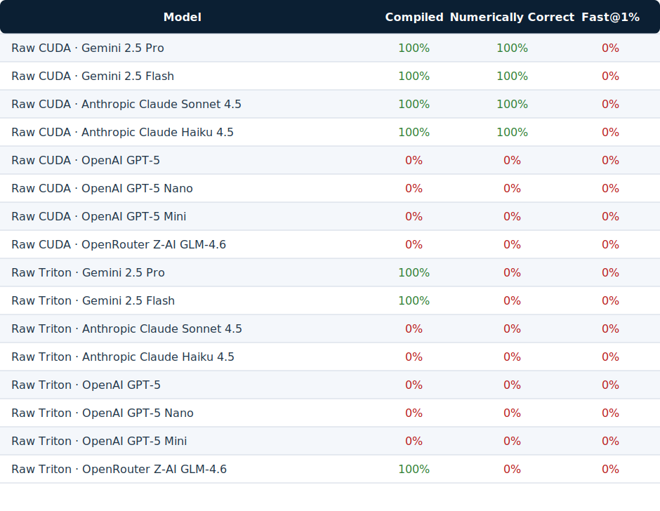

# KernelBench-v3



`—` indicates the agentic pipeline has not yet completed a fresh sweep for that provider/model pair.

Unified benchmark for evaluating LLM-generated GPU kernels (CUDA & Triton) in both raw and agentic workflows.

---

## Roadmap & Progress

- [x] Provide ready-to-run Groq comparison configs for CUDA/Triton and raw/agentic modes.
- [x] Normalize agentic output directories so visualization detects recent runs automatically.
- [x] Auto-migrate legacy agentic JSONL files into the new layout for seamless visualization.
- [x] Limit Groq comparison visualizations to PNG artifacts only.
- [ ] Modal support for spinning up any Nvidia GPU for benchmarking, instead of being fixed to my 3090 at home.

## ✅ Overview

KernelBench-v3 merges the original KernelBench-v2 and GEAK-eval codebases into a single, configurable framework. A single configuration file (`config.py`) and entry point (`eval.py`) power both zero-shot (“raw”) and multi-turn (“agentic”) evaluation modes across multiple LLM providers.

### Key Features

- **Dual Modes**
  - **Raw**: direct, zero-shot kernel generation and evaluation.
  - **Agentic**: multi-iteration, self-correcting workflow with memories, retrieval, and reflection.
- **Triton & CUDA Support**: automatic detection, unified correctness/performance evaluation.
- **Provider Abstraction**: pluggable interfaces for OpenAI, Anthropic, Groq, XAI, Gemini, Cerebras, Ollama, vLLM, SGLang, etc.
- **Single Repo Layout**: all datasets, results, prompts, and scripts reside inside `KernelBench-v3/`.
- **CLI-first UX**: `eval.py` accepts provider/model flags, run limits, and verbosity in a consistent way.
- **Extensive Error Categorization**: production-friendly diagnostics for compilation/runtime failures.

---

## 📁 Repository Structure (Highlights)

```
KernelBench-v3/
├── config.py                # Global configuration dataclasses & defaults
├── eval.py                  # Unified entry point for raw/agentic runs
├── data/TritonBench/        # TritonBench dataset & metrics (copied in repo)
├── json/                    # Cached aggregate metrics per mode/language/model
├── plots/                   # Visualization artifacts (PNG only)
├── outputs/                 # Legacy agentic outputs (JSONL, kept for back-compat)
├── runs/                    # Raw & agentic run artifacts (manifests + per-problem logs)
├── scripts/                 # Legacy scripts (generate, eval, analysis)
├── src/
│   ├── providers/           # Provider wrappers (OpenAI, Groq, etc.)
│   ├── raw/                 # Raw evaluation orchestrator & helpers
│   ├── agentic/             # Agentic pipeline (agents, memories, runner)
│   ├── prompt_constructor.py
│   ├── utils.py             # Shared utilities, LLM query helper
│   └── ...
├── TRITON_INTEGRATION_GUIDE.md  # Deep dive on Triton integration
├── TRITON_README.md             # (Now merged into this README)
└── requirements.txt
```

---

## 🔧 Setup

### 1. Clone & Enter Repo
```bash
cd /home/infatoshi/gpu_benchmarks/KernelBench-v3
```

### 2. Automated Setup & Smoke Test

The repository is now an [uv](https://github.com/astral-sh/uv) project. After cloning you can bring up a fresh environment with:

```bash
uv sync
source .venv/bin/activate
```

This creates `.venv` and installs every dependency declared in `pyproject.toml`.
```bash
bash setup_and_test.sh
```

> The script installs `uv` if missing, creates `.venv`, installs dependencies, validates CUDA availability, checks `GROQ_API_KEY`, and runs raw/agentic smoke tests with Groq `moonshotai/kimi-k2-instruct-0905`.

### 3. Manual Environment Setup (Optional)

> Alternatively, use Conda/Pip to install dependencies.

### 4. Configure API Keys (Required)
```bash
export GROQ_API_KEY="your-groq-key"  # required for smoke tests & Groq runs
# export OPENAI_API_KEY="your-openai-key"
# export ANTHROPIC_API_KEY="your-anthropic-key"
# export GEMINI_API_KEY="your-gemini-key"
```

Formatter overrides are configured via CLI/YAML—see [Formatter (Always On)](#formatter-always-on).

### Modal Raw GPU Runs (Experimental)

Modal orchestration currently supports **raw kernels only**; the agentic pipeline remains offline to avoid runaway GPU costs.

#### Quickstart

```bash
git clone https://github.com/Infatoshi/KernelBench-v3.git && cd KernelBench-v3
bash setup.sh
bash run.sh
```

`setup.sh` installs `uv`, synchronizes the project environment, and prompts you to create a Modal token via `modal token new`. `run.sh` submits the Modal job (`tools/modal_raw.py`) that provisions the CUDA image, syncs the repo in a writable workspace, and launches the raw benchmark.

Configuration lives in `configs/modal_raw.yaml`. Adjust the `modal.image` block to change the CUDA version or Ubuntu tag (`ubuntu24.04` by default), and update `modal.gpu.name` to target a different GPU tier. The default subprocess timeout is 120 seconds; set `MODAL_RUN_TIMEOUT=0` and `modal.timeouts.process_seconds: 0` if you need to disable the safeguard.

`run.sh` forwards `GROQ_API_KEY` to Modal automatically when the variable is set locally; the task logs whether the secret was attached before submitting the job. If Modal credentials are missing, the script aborts with instructions to rerun `uv run modal token new`.

---

## ⚙️ Configuration (config.py)

`config.py` defines the full dataclass configuration. Key fields:

```python
BenchmarkConfig(
    mode="raw",                 # "raw" or "agentic"
    language="triton",          # "cuda" or "triton" (auto detection still applies)
    provider="openai",          # default provider if CLI override not provided
    provider_base_url=None,      # optional base URL override
    generator_model="gpt-4-turbo",
    num_runs=None,               # "all" or integer limit
    verbose=False,               # enable verbose logging
    hardware=HardwareConfig(...),
    problems=ProblemSetConfig(...),
    agentic=AgenticConfig(...),
    fast_p_threshold=None,    # set a float (e.g. 1.2) to enable perf profiling
    raw_concurrency=8,          # default raw worker pool (override via YAML or env)
    raw_gpu_concurrency=1,      # GPU slots consumed simultaneously per raw run
    profile_stages=False,       # enable per-problem stage timing breakdowns
)
```

You can modify defaults directly or override via CLI flags.

### Formatter (Always On)

- The Groq formatter now runs for every generation—there is no concise/disabled mode.
- Override provider/model globally via CLI (`--formatter-provider`, `--formatter-model`, `--formatter-base-url`) or YAML defaults:

  ```yaml
  defaults:
    formatter:
      provider: groq
      model: moonshotai/kimi-k2-instruct-0905
      base_url: https://api.groq.com/openai/v1
  ```

- Per-model overrides remain available, but leaving them unset inherits the global defaults so that every kernel gets a formatted candidate.

The formatter performs a second LLM pass to enforce a single fenced `python` block containing a complete `ModelNew` implementation, complementing the stricter CUDA/Triton prompts in `src/prompt_constructor.py`.

### Raw Concurrency

- Raw runs now parallelize LLM prompting and compilation prep across as many CPU workers as your host exposes (default equals `os.cpu_count()`), feeding a shared GPU evaluation queue.
- Override CPU fan-out globally via YAML with `raw_concurrency: max` (default) or any explicit integer; CLI overrides accept the same token.
- `raw.max_jobs` follows the same convention, defaulting to the CPU thread count so job queues never bottleneck below available workers.
- Tune GPU queue throughput with `raw_gpu_concurrency` (default 2 consumer threads) if the device has headroom.
- Set both to `1` for fully sequential debugging, or raise CPU workers while keeping GPU slots low to overlap compilation with execution.

Performance profiling is disabled by default (no GPU timing trials). Re-enable it per run with `fast_p_threshold: 1.2` or via CLI `--fast-p-threshold 1.2` if you need speedup metrics.

Stage profiling (CPU prep, queue wait, GPU compile/correctness/perf) is off by default. Enable with `profile_stages: true` in YAML or `--profile-stages` on the CLI to capture per-problem timing breakdowns in the raw results.

---

## 📦 Run Artifact Layout

Every invocation now writes a single directory under `runs/` with a timestamped slug:

```
runs/
  20251025_012633_agentic_triton_openai_gpt-5/
    manifest.yaml
    kernel_001_context_attn_nopad.py/
      summary.txt
      instruction.txt
      reference_solution.py
      test_harness.py
      final_code.py
      last_raw_candidate.py
      history/
        iteration_00/solution.txt
        iteration_00/execution.txt
        iteration_00/performance.txt
        iteration_00/reflection.txt
        iteration_01/...
    kernel_002_...
```

- **manifest.yaml** captures provider/model metadata, concurrency settings, formatter configuration, and a per-kernel summary (call/exec/perf pass flags and runtime hints).
- The manifest also records `elapsed_seconds` (wall-clock runtime rounded to 0.1s) so you can compare how long each provider/model/problem sweep took.
- **summary.txt** highlights the outcome for the kernel along with any errors.
- **history/** holds plain-text logs for each iteration and stage. Requests, kwargs, responses, execution stdout/stderr, and performance diagnostics are all written without JSON so you can skim directly in the terminal.
- Raw runs emit the same structure, with `prompt.txt`, `response_raw.txt`, `response_formatted.txt`, and `metrics.yaml` mirroring the agentic history.

Legacy JSONL traces remain untouched inside `outputs/` for backwards compatibility with older analysis scripts, but new tooling should rely on the `runs/` layout.

### Logging

- Verbose mode is always enabled. Batch runner headers render as `mode + language + provider/model` in green, and no concise mode is exposed.
- Raw and agentic runners dump every LLM exchange in plain text—system prompts, user prompts, kwargs, and responses—without JSON framing so the terminal output stays readable.
- Agentic iterations record the same information under each kernel's `history/` folder for offline inspection.
- To keep the console manageable, LLM prompts/responses and formatted kernels are truncated to head/tail slices with an ellipsis and a loud error banner is emitted whenever a stage fails.
- Agentic runs reuse the evaluated provider/model for every phase (generation, optimizer, reflection) so metrics reflect that single LLM end-to-end.

---

## 🚀 Unified CLI Usage (`eval.py`)

### Batch Mode (Recommended)

Run multiple models from a YAML config file:

```bash
uv run python eval.py --config configs/example_batch.yaml
```

YAML structure:
```yaml
modes: [raw, agentic]
languages: [cuda, triton]

defaults:
  num_runs: 20
  raw:
    cpu_concurrency: 8
    gpu_concurrency: 1
    max_jobs: 8
  agentic:
    max_debug_attempts: 3
    max_optimization_cycles: 2

hardware:
  gpu_architecture: Ampere
  gpu_id: 0

problems:
  levels: [1]
  problem_ids: null
  max_problems: 100

models:
  - provider: groq
    model: llama-3.3-70b-versatile
  - provider: openai
    model: gpt-4o-2024-08-06
  - provider: anthropic
    model: claude-3-5-sonnet-20241022

artifacts:
  json_dir: json
  plots_dir: plots

visualization:
  enabled: true
  metrics:
    - compilation_rate
    - correctness_rate
    - fast_1_rate
```

### Single-Run Mode (Legacy)

For quick one-off tests:

```bash
uv run python eval.py --mode raw \
  --provider groq \
  --model llama-3.3-70b-versatile
```

### Examples

#### Multi-Provider Benchmark
```bash
# Compare 6 models on 20 problems with auto-visualization
uv run python eval.py --config configs/multi_provider_benchmark.yaml
```

#### Quick Test (3 problems, 1 model)
```bash
uv run python eval.py --config configs/quick_test.yaml
```

#### Agentic Multi-Model
```yaml
# Create configs/agentic_batch.yaml
modes: [agentic]
languages: [triton]

defaults:
  num_runs: 5
  agentic:
    max_debug_attempts: 3
    max_optimization_cycles: 2

models:
  - provider: groq
    model: llama-3.3-70b-versatile
  - provider: openai
    model: gpt-4o

artifacts:
  json_dir: json
  plots_dir: plots

visualization:
  enabled: true
  metrics: [compilation_rate, correctness_rate, fast_1_rate]
```
```bash
uv run python eval.py --config configs/agentic_batch.yaml
```

### Output Locations
- **Raw mode**: `runs/raw_{language}_{provider}_{model}/results.jsonl`
- **Agentic mode**: `outputs/agentic_{provider}_{model}/results.jsonl`
- **Batch summary**: `json/batch_summary_{timestamp}.json`
- **Visualizations**: `plots/benchmark_{metric}_{timestamp}.png`

---

## 🔌 Supported Providers & Environment Variables

| Provider | Example Model | Env Var | Notes |
|----------|---------------|---------|-------|
| `openai` | `gpt-4o-2024-08-06` | `OPENAI_API_KEY` | OpenAI Chat Completions |
| `anthropic` | `claude-3-5-sonnet-20241022` | `ANTHROPIC_API_KEY` | Messages API |
| `groq` | `llama-3.3-70b-versatile` | `GROQ_API_KEY` | Low latency/free tier |
| `xai` | `grok-beta` | `XAI_API_KEY` | OpenAI-compatible |
| `gemini` | `gemini-1.5-flash-002` | `GEMINI_API_KEY` | Google Generative AI |
| `cerebras` | `llama-4-scout-17b-16e-instruct` | `CEREBRAS_API_KEY` | SDK or fallback |
| `ollama` | `codellama:34b` | n/a (local) | `--base-url http://localhost:11434/v1` |
| `vllm` | Self-hosted model | n/a | `--base-url http://localhost:8000/v1` |
| `sglang` | Custom model | `SGLANG_API_KEY` (optional) | `--base-url http://localhost:30000/v1` |

> Each provider wrapper lives under `src/providers/` as a subclass of `BaseProvider`.

---

## 🧠 Raw vs Agentic Workflows

### Raw
- Zero-shot generation.
- Evaluates each problem once.
- Uses prompt templates from `src/prompt_constructor.py` and provider’s `generate()`.
- Outputs per-problem JSONL with metadata (compilation status, correctness, runtime).

### Agentic
- Multi-iteration process with retrieval, reflection, and memories.
- Components:
  - `agentic/agents/OptimAgent.py`: orchestrates generation, execution, reflection.
  - `agentic/dataloaders/TritonBench.py`: dataset loader & performance evaluation.
  - `agentic/retrievers/retriever.py`: BM25-based instruction/code retrieval.
  - `agentic/memories/Memory.py`: memory classes (call/execution states).
- Outputs aggregated JSONL with the final agent decisions and metadata.

---

## 🧪 Evaluation Pipeline Details

### Shared Logic (`src/raw/eval.py`)
Key functions:
- `detect_triton_kernel(model_src)` – auto-detect Triton vs CUDA.
- `eval_kernel_against_ref_auto(...)` – unified evaluation entry.
- `eval_triton_kernel_against_ref(...)`, `eval_kernel_against_ref(...)` – mode-specific flows.
- Extensive error categorization stored in `KernelExecResult.metadata`.

### Raw Runner Steps
1. Resolve problems from `KernelBench/levelX` directories.
2. Construct prompt using `prompt_constructor`.
3. Call provider to generate kernel code.
4. Evaluate compiled kernel vs reference; record metadata.
5. Write output JSONL to `runs/<provider_model_timestamp>.jsonl`.

### Agentic Runner Steps
1. Load `TritonBench` JSON (instructions + reference metadata).
2. Filter problem states (`levels`, `problem_ids`, `num_runs`).
3. Spin up provider wrapper + `OptimAgent`.
4. Iterate: generate candidate → test on GPU → reflect/update memory.
5. Optionally run performance evaluation (TritonBench harness).
6. Write output JSONL to `outputs/<provider_model_timestamp>.jsonl`.

---

## 🧰 Triton Integration Highlights
(Taken from former `TRITON_README.md` & `TRITON_INTEGRATION_GUIDE.md`)

- **Source Persistence**: Triton kernels are written to temporary files so `inspect.getsourcelines()` works.
- **Dedicated Cache**: Build directory for Triton kernels (`TRITON_CACHE_DIR`).
- **Error Handling**: Specific categories for JIT/autotuning/source inspection issues.
- **Cleanup**: Remove temporary modules/files, clear CUDA caches after evaluation.
- **Docker Support**: Ready for `--gpus all` environments.

### Quick Triton Evaluation Example
```bash
uv run python scripts/run_and_check_triton.py \
  ref_origin=kernelbench \
  level=1 \
  problem_id=1 \
  kernel_src_path=src/prompts/model_new_ex_matmul_triton.py \
  verbose=True
```

---

## 📊 Metrics & Reporting

### Core Metrics
- **Compilation Rate**: `(compiled / total) × 100%` - Percentage of kernels that compile without errors
- **Correctness Rate**: `(correct / compiled) × 100%` - Percentage of compiled kernels passing correctness tests
- **fast_1 Rate**: Percentage of kernels achieving >1.0x speedup vs baseline
- **fast_2 Rate**: Percentage achieving >2.0x speedup
- **Mean Speedup**: Average performance improvement for correct kernels

### Output Formats

**Per-Problem Results** (JSONL):
```json
{
  "level": 1,
  "problem_id": 1,
  "problem_name": "1_Square_matrix_multiplication_.py",
  "compiled": true,
  "correctness": true,
  "runtime": 0.245,
  "metadata": {"hardware": "NVIDIA RTX 3090", ...},
  "generated_code": "..."
}
```

**Batch Summary** (JSON):
```json
{
  "config": "configs/example_batch.yaml",
  "total_models": 5,
  "completed": 5,
  "failed": 0,
  "results": [
    {
      "provider": "groq",
      "model": "llama-3.3-70b-versatile",
      "status": "completed",
      "timestamp": "2025-10-17T21:51:51.270145"
    },
    ...
  ]
}
```

### Visualizations

When `visualization.enabled: true` in YAML config, the batch runner automatically generates:

1. **Bar Charts**: Side-by-side comparison of compilation%, correctness%, and speedup metrics
2. **Summary Tables**: Markdown tables with detailed breakdowns

Charts are saved to `plots/` as PNG files keyed by metric.

---

## 🎨 Batch Benchmarking & Visualization

### Quick Start: Run Multiple Models

```bash
# 1. Create or use existing YAML config
cat configs/multi_provider_benchmark.yaml

# 2. Run batch benchmark (all models execute sequentially)
uv run python eval.py --config configs/multi_provider_benchmark.yaml

# 3. Results automatically saved and visualized:
#    - runs/raw_{language}_{provider}_{model}/results.jsonl (per raw run)
#    - outputs/agentic_{provider}_{model}/results.jsonl (per agentic run)
#    - json/batch_summary_{timestamp}.json (aggregate metadata)
#    - plots/benchmark_{metric}_{timestamp}.png (one file per metric)
```

> Tip: successful runs cache aggregate metrics in `json/`. Subsequent executions reuse the cache when the configuration fingerprint matches; delete the relevant JSON file to force a fresh evaluation.

### YAML Configuration Schema

```yaml
# Global settings
mode: raw | agentic
language: cuda | triton
num_runs: <int> | "all"
verbose: true | false

hardware:
  gpu_architecture: Ampere  # Maxwell|Pascal|Volta|Turing|Ampere|Hopper|Ada
  gpu_id: 0

problems:
  levels: [1, 2, 3]          # Which difficulty levels
  problem_ids: [1, 5, 10]    # Specific IDs or null for all
  max_problems: 100          # Cap per level

agentic:                     # Only used if mode=agentic
  max_debug_attempts: 3
  max_optimization_cycles: 2
  # reflector_model and optimizer_model automatically reuse the generator model.

fast_p_threshold: 1.2        # Speedup threshold

# List of models to benchmark
models:
  - provider: groq
    model: llama-3.3-70b-versatile
    # Optional per-model overrides:
    base_url: null             # Custom endpoint
    num_runs: 10               # Override global num_runs
    
  - provider: openai
    model: gpt-4o-2024-08-06

visualization:
  enabled: true
  output_dir: visualizations
  formats: [png, pdf]
  metrics:
    - compilation_rate
    - correctness_rate
    - fast_1_rate
```

### Pre-Made Configurations

| Config | Description | Models | Problems |
|--------|-------------|--------|----------|
| `quick_test.yaml` | Single model, 3 problems | Groq Llama | 3 |
| `test_providers.yaml` | Multi-provider smoke test | 8 models | 1 |
| `only_kimi.yaml` | Kimi K2 across all modes/languages | 1 model | full |
| `test_visualization.yaml` | Two models for viz testing | 2× Groq | 2 |
| `example_batch.yaml` | Full multi-provider comparison | 5 models | 10 |
| `multi_provider_benchmark.yaml` | Production benchmark | 6 models | 20 |
| `groq_all.yaml` | Groq CUDA/Triton × raw/agentic matrix | 2 models | full |

### Metrics Visualized

Charts generated include:
- **Compilation Rate**: % of attempts that compile successfully
- **Correctness Rate**: % of compiled kernels passing functional tests
- **fast_1 Rate**: % achieving speedup > 1.0x (faster than baseline)

Outputs saved to `visualizations/` as PNG/PDF with timestamp.

---

## 🧪 Testing & Verification
Run this command (preflight + benchmark) once your API keys are exported:

```bash
uv run python eval.py --config configs/test_visualization.yaml --profile-stages --verbose
```

> The entrypoint automatically pings each provider/model with a "Hello." request before starting the benchmark and aborts if any credentials or model names are misconfigured.

Optional deep-dive tests (if you need them):

```bash
python test_llm_providers.py
pytest -q src/unit_tests
python test_triton_integration.py
python scripts/verify_bench.py
```

---

## 🐛 Troubleshooting

| Issue | Resolution |
|-------|------------|
| "could not get source code" (Triton) | Use builtin loader (`load_custom_model_triton`); ensure `triton` installed |
| Provider 401/403 | Confirm provider-specific API keys (e.g., `OPENAI_API_KEY`, `ANTHROPIC_API_KEY`) |
| CUDA compilation noise | Run without `--verbose` (raw mode suppresses Ninja output by default) |
| Performance evaluation errors | Check `data/TritonBench/performance_metrics/` availability; inspect logs in `outputs/` |

---

## 📚 External Resources
- [KernelBench Paper](https://arxiv.org/abs/2502.10517)
- [Blog Post](https://letters.lossfunk.com/p/780796ba-8f4d-494b-8898-b80f0636d2b7)
- [Triton Documentation](https://triton-lang.org/)
- [Caesar Framework](https://github.com/simonguozirui/caesar) for multi-turn strategies.

---

## 🪪 License & Citation

MIT License (see `LICENSE`).

```bibtex
@misc{ouyang2025kernelbenchllmswriteefficient,
  title={KernelBench: Can LLMs Write Efficient GPU Kernels?},
  author={Anne Ouyang and Simon Guo and Simran Arora and Alex L. Zhang and William Hu and Christopher Ré and Azalia Mirhoseini},
  year={2025},
  eprint={2502.10517},
  archivePrefix={arXiv},
  primaryClass={cs.LG},
  url={https://arxiv.org/abs/2502.10517},
}
```

---

**Need help?** Run `python test_llm_providers.py` to verify your provider setup before launching full benchmarks. 🚀

## Other benchmarks:
- GEAK-eval (completely different — agentic)
- KernelBench-v2 (kernelbench-v1 + triton)
- MultiKernelBench (i dont have the hardware yet… so pause)
- TritonBench (covered in geak-eval and kernelbench-v2)
